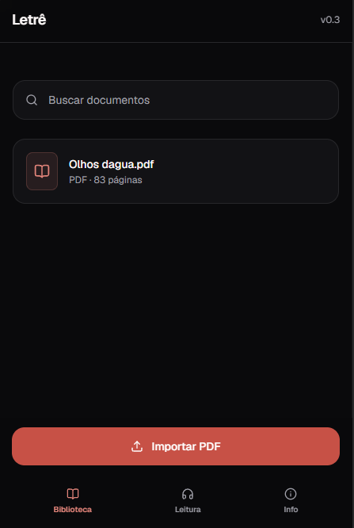
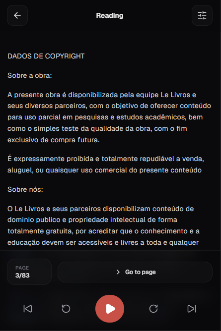

# Letrê

Um leitor de documentos digitais desenvolvido com foco em acessibilidade, personalização e uma experiência de leitura confortável em dispositivos móveis.

## Sobre o projeto

O Letrê é uma aplicação web que permite importar e visualizar documentos PDF em uma interface simples e intuitiva. O projeto busca oferecer uma experiência de leitura agradável, com foco na organização dos documentos, na acessibilidade e na evolução contínua dos recursos de leitura.

## Prévia do projeto

### Biblioteca

### Leitura

## Tecnologias utilizadas

- **Next.js** — estrutura da aplicação com App Router.
- **TypeScript** — tipagem estática para maior segurança no desenvolvimento.
- **Tailwind CSS** — estilização e construção da interface.
- **Zustand** — gerenciamento de estado.
- **Lucide React** — biblioteca de ícones.
- **PDF.js** — processamento e visualização de documentos PDF.

## Funcionalidades

- **Biblioteca de documentos:** importação e organização de arquivos PDF.
- **Leitor integrado:** visualização do conteúdo dos documentos.
- **Interface responsiva:** experiência adaptada para dispositivos móveis e desktops.
- **Configurações de leitura:** painel dedicado à personalização da experiência.
- **Navegação simplificada:** acesso rápido à biblioteca, à leitura e às informações do projeto.

## Desenvolvido por

**João Paulo**

Projeto desenvolvido para portfólio, com foco no aprendizado de Next.js, TypeScript e desenvolvimento front-end.

---

_One commit at a time._
